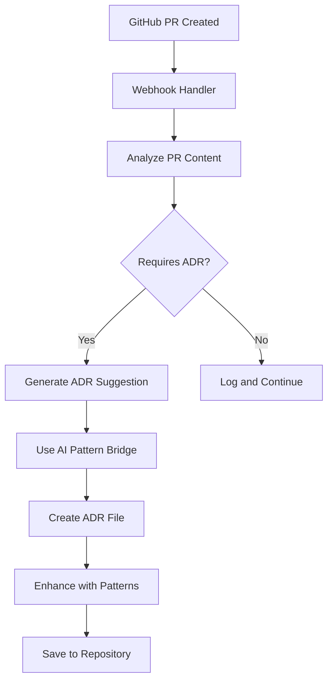

# 🏗 AI Pattern Bridge System Architecture

## Core Components

### 1. AI Pattern Bridge (`core/ai-pattern-bridge.js`)
**Purpose**: Convert institutional patterns into AI-executable instructions

```javascript
class AIPatternBridge {
  // Pattern loading and processing
  async loadPatterns()
  
  // AI instruction generation  
  async generateAIInstructions(description, projectType)
  
  // Project analysis and team assignment
  async processProject(description, options)
}
```

### 2. GitHub Webhook Handler (`core/github-webhook-handler.js`)
**Purpose**: Auto-capture architectural decisions from development activities

```javascript
class GitHubWebhookHandler {
  // PR analysis and ADR generation
  async handlePullRequestEvent(payload)
  
  // ADR file creation using existing tools
  async createADRFile(suggestion, pullRequest, repository)
  
  // Pattern-based analysis
  async analyzePullRequest(pullRequest, repository)
}
```

## Pattern System

### Pattern Card Structure
```markdown
# Pattern Name

## When to Use
- Specific scenarios and conditions

## Implementation
- Multi-language code examples
- Framework-specific guidance

## Quality Gates
- Measurable success criteria

## Anti-Patterns
- What NOT to do
```

### Current Patterns
1. **ADR-Driven Development** - Decision documentation
2. **Pattern Card Creation** - Knowledge standardization  
3. **CI/CD Gate Pattern** - Automated governance
4. **API Error Handler** - Consistent error handling
5. **Component Library** - Reusable UI patterns

## AI Team Coordination

### Team Assignment Algorithm
```javascript
aiTeamAssignment: {
  "frontend": {
    ai: "claude",
    specialization: "@frontend", 
    patterns: ["Component Library", "State Management"],
    instructions: "Detailed role-specific guidelines",
    qualityGates: ["TypeScript interfaces", "Accessibility"]
  },
  "backend": {
    ai: "gpt-4",
    specialization: "@backend",
    patterns: ["API Gateway", "Authentication"],
    instructions: "Secure, scalable backend development",
    qualityGates: ["JWT validation", "Input sanitization"]
  }
}
```

### Quality Gates System
- **Code Quality**: Syntax, types, patterns
- **Security**: Authentication, validation, sanitization
- **Performance**: Benchmarks, optimization
- **Documentation**: ADRs, API docs, runbooks

## Auto-Capture Workflow



### Decision Triggers
- **Size-based**: >200 lines changed
- **Content-based**: Architecture keywords detected
- **File-based**: Core system files modified

## Integration Points

### Existing Tools
- `tools/adr_new.sh` - ADR file creation
- GitHub Actions - CI/CD enforcement
- Pattern library - Reusable solutions

### External Systems
- GitHub API - PR comments, status checks
- Vector databases - Semantic search (planned)
- Monitoring - Usage analytics (planned)

## Data Flow

### Pattern → AI Instructions
1. Load pattern cards from filesystem
2. Parse markdown structure and code examples
3. Generate role-specific instructions
4. Add quality gates and anti-patterns
5. Format for AI consumption

### PR → ADR Generation
1. Receive GitHub webhook event
2. Analyze PR for architectural significance
3. Extract problem statement and context
4. Generate structured ADR suggestion
5. Create physical ADR file with metadata

---

*This architecture enables revolutionary AI team coordination through pattern-driven development*