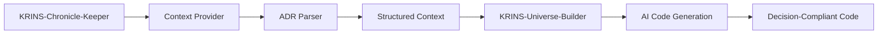

# 🤖 AI Integration Guide - KRINS-Chronicle-Keeper

**Integration with KRINS-Universe-Builder for intelligent code generation**  
**Last Updated:** 2025-09-06

---

## 🎯 **Overview**

KRINS-Chronicle-Keeper provides organizational intelligence to KRINS-Universe-Builder through structured context provision. This enables AI-powered code generation that automatically follows your team's architectural decisions.

### **Integration Benefits**
- ✅ **Consistent Architecture** - AI follows established decisions
- ✅ **Automatic Compliance** - No more architecture drift
- ✅ **Faster Onboarding** - New developers see architectural context
- ✅ **Decision Tracking** - Know which ADRs influence code generation

---

## 🔄 **Integration Workflow**



### **Step-by-Step Process**
1. **ADR Creation** - Team creates architectural decisions using `tools/adr_new.sh`
2. **Context Extraction** - AI integration parses ADRs and patterns
3. **Context Provision** - Structured context sent to Universe-Builder
4. **AI Generation** - Code generated following architectural decisions
5. **Compliance Validation** - Generated code automatically complies with ADRs

---

## 🏗️ **Setup Instructions**

### **Prerequisites**
- KRINS-Chronicle-Keeper repository with ADRs
- KRINS-Universe-Builder repository
- Both systems in same workspace directory

### **Directory Structure**
```
your-workspace/
├── KRINS-Universe-Builder/      # AI universe system
└── KRINS-Chronicle-Keeper/     # This organizational intelligence system
    ├── docs/adr/               # Your ADRs
    ├── ai-integration/         # Context provider components
    └── docs/patterns/          # Code patterns
```

### **Configuration**
1. **Environment Setup**
   ```bash
   # In KRINS-Chronicle-Keeper directory
   export CHRONICLE_KEEPER_PATH=$(pwd)
   export UNIVERSE_BUILDER_PATH="../KRINS-Universe-Builder"
   ```

2. **Context Provider Setup**
   ```typescript
   // In your application code
   import { createContextProvider } from './ai-integration/context-provider';
   
   const contextProvider = createContextProvider();
   const organizationalContext = await contextProvider.getContextForAI();
   ```

---

## 🔧 **API Reference**

### **Context Provider API**

#### **getContextForAI()**
Returns complete organizational context for AI consumption.

```typescript
interface OrganizationalContext {
  decisions: ADRDecision[];       // All architectural decisions
  patterns: CodePattern[];       // Language-specific patterns
  constraints: ArchitecturalConstraint[];  // Architectural constraints
  runbooks: RunbookReference[];  // Operational procedures
  lastUpdated: Date;             // Context freshness
}
```

#### **getContextForTechnology(technology: string)**
Returns filtered context relevant to specific technology.

```typescript
// Example: Get context for PostgreSQL decisions
const pgContext = await contextProvider.getContextForTechnology('postgresql');
```

#### **generateContextSummary(context: OrganizationalContext)**
Generates AI-optimized context summary for prompt injection.

```typescript
const summary = await contextProvider.generateContextSummary(context);
// Use summary in AI prompts for Universe-Builder
```

---

## 📋 **ADR Integration Examples**

### **Example 1: Database Technology Decision**

**ADR-0002: Use pgvector for semantic search**
```markdown
## Decision
We will use PostgreSQL with pgvector extension for semantic search functionality.

## Rationale
- Vector similarity search capabilities
- Existing PostgreSQL expertise in team
- ACID compliance requirements
```

**Generated Code (AI automatically follows ADR):**
```typescript
// AI generates this based on ADR-0002
import { Pool } from 'pg';

export class SemanticSearchService {
  private pool: Pool;

  async searchDocuments(query: string) {
    // Following ADR-0002: pgvector for semantic search
    const embedding = await this.generateEmbedding(query);
    
    const result = await this.pool.query(`
      SELECT content, 1 - (embedding <=> $1) as similarity
      FROM documents 
      ORDER BY embedding <=> $1 
      LIMIT 10
    `, [embedding]);
    
    return result.rows;
  }
}
```

### **Example 2: Authentication Pattern**

**Pattern Definition:**
```typescript
// docs/patterns/typescript/auth-pattern.md
export interface AuthenticationPattern {
  // JWT token-based authentication
  // Following zero-trust principles
  validateToken(token: string): Promise<UserContext>;
}
```

**Generated Code:**
```typescript
// AI automatically applies authentication pattern
export class AuthService implements AuthenticationPattern {
  async validateToken(token: string): Promise<UserContext> {
    // Implementation follows established pattern
    return this.jwtValidator.validate(token);
  }
}
```

---

## 🔍 **Context Types & Structures**

### **ADRDecision Interface**
```typescript
interface ADRDecision {
  id: string;                    // ADR-0001
  title: string;                 // Human-readable title
  status: 'proposed' | 'accepted' | 'deprecated' | 'superseded';
  decision: string;              // The actual decision
  rationale: string;            // Why this decision was made
  consequences: string[];        // Impact of the decision
  relatedDecisions: string[];    // Links to other ADRs
  implementationNotes?: string;  // Implementation guidance
  createdDate: Date;
  lastUpdated: Date;
}
```

### **CodePattern Interface**
```typescript
interface CodePattern {
  language: string;              // typescript, python, java
  category: string;              // auth, database, api
  pattern: string;               // Pattern name
  description: string;           // Pattern description
  examples: string[];            // Code examples
  relatedADRs: string[];        // Associated decisions
}
```

### **ArchitecturalConstraint Interface**
```typescript
interface ArchitecturalConstraint {
  type: 'technology' | 'security' | 'performance' | 'governance';
  description: string;           // Constraint description
  enforcementLevel: 'mandatory' | 'recommended' | 'optional';
  validation: string;            // How to validate compliance
  relatedADRs: string[];        // Source decisions
}
```

---

## 🚀 **Advanced Integration Features**

### **Technology-Specific Context**
```typescript
// Get context for specific technologies
const reactContext = await contextProvider.getContextForTechnology('react');
const postgresContext = await contextProvider.getContextForTechnology('postgresql');
const k8sContext = await contextProvider.getContextForTechnology('kubernetes');
```

### **Context Caching**
```typescript
// Implement caching for performance
class CachedContextProvider extends ContextProvider {
  private cache = new Map<string, OrganizationalContext>();
  
  async getContextForAI(): Promise<OrganizationalContext> {
    const cacheKey = 'full-context';
    if (this.cache.has(cacheKey)) {
      return this.cache.get(cacheKey)!;
    }
    
    const context = await super.getContextForAI();
    this.cache.set(cacheKey, context);
    return context;
  }
}
```

### **Real-time Context Updates**
```typescript
// Watch for ADR changes and update context
import { watchFile } from 'fs';

class RealtimeContextProvider extends ContextProvider {
  private contextCache?: OrganizationalContext;
  
  constructor(baseDirectory: string) {
    super(baseDirectory);
    this.watchADRChanges();
  }
  
  private watchADRChanges(): void {
    watchFile(`${this.adrDirectory}/*.md`, () => {
      this.contextCache = undefined; // Invalidate cache
    });
  }
}
```

---

## 📊 **Monitoring & Metrics**

### **Context Usage Tracking**
```typescript
interface ContextUsageMetrics {
  totalContextRequests: number;
  averageContextSize: number;
  mostUsedADRs: string[];
  technologyBreakdown: Record<string, number>;
  cacheHitRate: number;
}
```

### **Decision Influence Tracking**
```typescript
// Track which ADRs influence code generation
class DecisionInfluenceTracker {
  async trackDecisionUsage(adrId: string, generatedCode: string): Promise<void> {
    // Record which decisions influenced which code generation
    await this.recordUsage({
      adrId,
      timestamp: new Date(),
      codeSnippet: generatedCode.substring(0, 200),
      technology: this.detectTechnology(generatedCode)
    });
  }
}
```

---

## 🔒 **Security & Privacy**

### **Context Sanitization**
```typescript
// Sanitize sensitive information from context
class SecureContextProvider extends ContextProvider {
  async getContextForAI(): Promise<OrganizationalContext> {
    const context = await super.getContextForAI();
    return this.sanitizeContext(context);
  }
  
  private sanitizeContext(context: OrganizationalContext): OrganizationalContext {
    // Remove sensitive information like API keys, secrets, etc.
    return {
      ...context,
      decisions: context.decisions.map(d => ({
        ...d,
        decision: this.removeSensitiveInfo(d.decision),
        rationale: this.removeSensitiveInfo(d.rationale)
      }))
    };
  }
}
```

---

## 🎯 **Best Practices**

### **ADR Writing for AI Integration**
1. **Be Specific** - Include concrete implementation details
2. **Use Technology Keywords** - Mention specific technologies and patterns
3. **Include Examples** - Provide code examples when relevant
4. **Link Related Decisions** - Reference related ADRs explicitly
5. **Update Regularly** - Keep decisions current and relevant

### **Pattern Organization**
1. **Language-Specific** - Organize patterns by programming language
2. **Category-Based** - Group related patterns together
3. **Example-Rich** - Include multiple implementation examples
4. **ADR-Linked** - Reference the decisions that define the patterns

### **Context Optimization**
1. **Cache Aggressively** - Context parsing can be expensive
2. **Filter Relevantly** - Provide only relevant context for each request
3. **Update Incrementally** - Only reparse changed ADRs
4. **Monitor Usage** - Track which contexts are most valuable

---

## 🔧 **Troubleshooting**

### **Common Issues**

#### **Context Not Loading**
```bash
# Check directory structure
ls -la docs/adr/
ls -la ai-integration/

# Verify file permissions
chmod +r docs/adr/*.md
```

#### **ADR Parsing Errors**
```typescript
// Enable debug logging
const contextProvider = createContextProvider('.');
contextProvider.setLogLevel('debug');
```

#### **Context Too Large**
```typescript
// Filter context for specific technology
const filteredContext = await contextProvider.getContextForTechnology('react');
```

---

## 📈 **Future Enhancements**

### **Planned Features**
- **Semantic Search** - Vector-based ADR similarity search
- **Change Detection** - Automatic context updates on ADR changes  
- **Context Versioning** - Track context evolution over time
- **Integration Analytics** - Detailed usage and effectiveness metrics

### **Extensibility**
- **Custom Parsers** - Support for additional documentation formats
- **Plugin System** - Extend context with custom data sources
- **API Integration** - Connect to external knowledge systems
- **Machine Learning** - AI-driven context relevance optimization

---

*This integration guide ensures KRINS-Chronicle-Keeper provides maximum value to KRINS-Universe-Builder for intelligent, decision-aware code generation.* 🤖📚