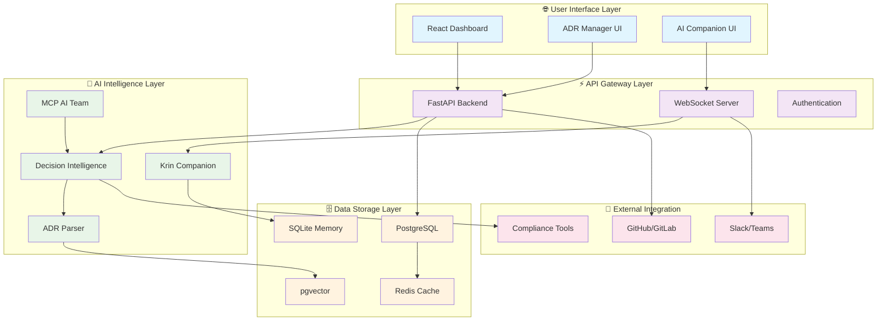

# KRINS-Chronicle-Keeper: Complete System Architecture Overview

**Version:** 1.0  
**Date:** September 7, 2025  
**Status:** Integrated Platform Architecture  
**Type:** Comprehensive System Design  

---

## 🎯 **Executive Architecture Summary**

KRINS-Chronicle-Keeper represents the world's most advanced organizational intelligence platform, combining AI-powered decision management, personal companion technology, and enterprise-grade deployment infrastructure. This integrated system transforms traditional ADR management into a living, intelligent ecosystem that learns, adapts, and provides predictive insights for organizational decision-making.

**Key Differentiators:**
- **Dual AI Intelligence:** Personal (Krin Companion) + Organizational (Decision Analytics)
- **Production-Ready Deployment:** Complete Docker + Railway infrastructure
- **Advanced Analytics:** 46KB NLP engine + decision effectiveness tracking
- **Real-Time Coordination:** MCP-based AI team coordination with WebSocket updates

---

## 🏛️ **High-Level System Architecture**

```
┌─────────────────────────────────────────────────────────────────────────────────┐
│                    🚀 KRINS-Chronicle-Keeper Platform                           │
│              "World's Most Advanced Organizational Intelligence"                │
└─────────────────────────────────────────────────────────────────────────────────┘

🌐 PRESENTATION LAYER (User Experience & Interfaces)
┌─────────────────────┬─────────────────────┬─────────────────────────────────────┐
│  📊 DASHBOARDS      │  📋 ADR MANAGER     │  🤖 AI COORDINATION                 │
│  ─────────────────  │  ───────────────    │  ─────────────────────────────────  │
│  • Netflix-style    │  • React Interface  │  • Krin Personal Companion         │
│  • Real-time data   │  • ADR Creation     │  • AI Team Dashboard               │
│  • Decision trends  │  • Batch Processing │  • Personality Matching            │
│  • Analytics views  │  • Template System  │  • Memory Integration              │
│  • Performance      │  • Search & Filter  │  • Context Awareness               │
│    metrics          │  • Export/Import    │  • Learning Adaptation             │
└─────────────────────┴─────────────────────┴─────────────────────────────────────┘

⚡ APPLICATION LAYER (Business Logic & APIs)
┌─────────────────────────────────────────────────────────────────────────────────┐
│                           🔧 FastAPI Backend Server                            │
│  ┌─────────────────┬─────────────────┬─────────────────┬─────────────────────┐ │
│  │ ADR Endpoints   │ Decision Engine │ AI Coordination │ Analytics API       │ │
│  │ • CRUD ops      │ • Tracking      │ • MCP servers   │ • Metrics           │ │
│  │ • Batch ops     │ • Linking       │ • Team coord    │ • Trends            │ │
│  │ • Templates     │ • Evidence      │ • Context       │ • Reports           │ │
│  │ • Validation    │ • Analytics     │ • Memory sync   │ • Predictions       │ │
│  │ • Search API    │ • Workflows     │ • Agent mgmt    │ • Dashboards        │ │
│  └─────────────────┴─────────────────┴─────────────────┴─────────────────────┘ │
└─────────────────────────────────────────────────────────────────────────────────┘

🧠 INTELLIGENCE LAYER (AI Processing & Analytics)
┌─────────────────────┬─────────────────────┬─────────────────────────────────────┐
│  💝 KRIN COMPANION  │  🔍 ADR PARSER       │  🎯 DECISION INTELLIGENCE           │
│  ─────────────────  │  ─────────────────   │  ─────────────────────────────────  │
│  • Personal Memory  │  • NLP Processing    │  • decision-tracker.ts (17KB)      │
│  • SQLite Storage   │  • 46KB Engine       │  • decision-linker.ts (21KB)       │
│  • Context Learning │  • Semantic Extract │  • evidence-collector.ts (28KB)    │
│  • Adaptive UI      │  • Pattern Recog     │  • Predictive Analytics            │
│  • Relationship     │  • Auto-tagging      │  • Effectiveness Tracking          │
│    Building         │  • Content Generate  │  • Risk Assessment                 │
└─────────────────────┴─────────────────────┴─────────────────────────────────────┘

🔗 COORDINATION LAYER (MCP & Team Integration)
┌─────────────────────┬─────────────────────┬─────────────────────────────────────┐
│  🤖 MCP AI TEAM     │  🎨 PERSONALITY     │  📡 REAL-TIME SYNC                 │
│  ─────────────────  │     MATCHING        │  ─────────────────────────────────  │
│  • 10+ AI Agents   │  ─────────────────   │  • WebSocket Updates               │
│  • Security Spec   │  • 3D Web Interface  │  • Live Dashboards                 │
│  • Coordination     │  • Team Optimization │  • Notification System             │
│  • Task Delegation  │  • AI Companion Gen  │  • State Synchronization           │
│  • Knowledge Share  │  • Preference Match  │  • Multi-user Coordination         │
│  • Context Routing  │  • Dynamic Teams     │  • Event Broadcasting              │
└─────────────────────┴─────────────────────┴─────────────────────────────────────┘

🗄️ DATA LAYER (Storage, Search & Persistence)
┌─────────────────────┬─────────────────────┬─────────────────────────────────────┐
│  🐘 POSTGRESQL      │  🔍 PGVECTOR         │  💾 REDIS CACHE                    │
│  ─────────────────  │  ─────────────────   │  ─────────────────────────────────  │
│  • ADR Storage      │  • Semantic Search   │  • Session Management              │
│  • Decision History │  • Vector Similarity │  • Real-time Updates               │
│  • Analytics Data   │  • Context Matching  │  • Performance Boost               │
│  • User Profiles    │  • Pattern Discovery │  • Temporary Storage               │
│  • Relationships    │  • Content Embedding │  • Queue Management                │
│  • Audit Trails     │  • Intelligent Query │  • Cache Invalidation              │
└─────────────────────┴─────────────────────┴─────────────────────────────────────┘

🐳 INFRASTRUCTURE LAYER (Deployment & Operations)
┌─────────────────────┬─────────────────────┬─────────────────────────────────────┐
│  🐳 DOCKER COMPOSE  │  🚀 RAILWAY DEPLOY  │  🔧 DEVELOPMENT                     │
│  ─────────────────  │  ─────────────────  │  ─────────────────────────────────  │
│  • Multi-container  │  • Production Ready │  • Bun Ecosystem                   │
│  • Service Mesh     │  • Auto Scaling     │  • Hot Reload                      │
│  • Local Dev        │  • SSL/HTTPS        │  • Testing Suite                   │
│  • Easy Setup       │  • CDN Integration  │  • CI/CD Pipeline                  │
│  • Backup Strategy  │  • Health Monitoring│  • Development Tools               │
│  • Network Security │  • Log Aggregation  │  • Performance Profiling          │
└─────────────────────┴─────────────────────┴─────────────────────────────────────┘
```

---

## 📁 **Comprehensive Directory Structure**

### **🏗️ Complete Project Organization:**

```
KRINS-Chronicle-Keeper/                    # 🏛️ Main Platform Root
├── 🌐 frontend/                           # React Web Application Layer
│   ├── src/
│   │   ├── components/                    # Reusable UI Components
│   │   │   ├── adr/                       # ADR Management Interface
│   │   │   │   ├── ADRCreator.tsx         # ✨ Create new ADRs with AI assistance
│   │   │   │   ├── ADRBrowser.tsx         # 🔍 Browse & search existing ADRs
│   │   │   │   ├── ADREditor.tsx          # ✏️ Rich text editing with templates
│   │   │   │   ├── ADRViewer.tsx          # 👁️ Read-only ADR display
│   │   │   │   ├── BatchProcessor.tsx     # ⚡ Bulk operations interface
│   │   │   │   ├── DecisionLinker.tsx     # 🔗 Visual relationship mapping
│   │   │   │   ├── EvidenceCollector.tsx  # 📊 Metrics & outcomes tracking
│   │   │   │   └── TemplateManager.tsx    # 📋 Template customization
│   │   │   ├── dashboards/                # Netflix-style Analytics Dashboards
│   │   │   │   ├── DecisionTrends.tsx     # 📈 Decision effectiveness over time
│   │   │   │   ├── TeamCoordination.tsx   # 👥 Multi-team collaboration view
│   │   │   │   ├── PerformanceMetrics.tsx # 🚀 System performance indicators
│   │   │   │   ├── ComplianceView.tsx     # ✅ Regulatory adherence status
│   │   │   │   ├── KnowledgeMap.tsx       # 🗺️ Organizational knowledge graph
│   │   │   │   └── PredictiveAnalytics.tsx # 🔮 AI-powered insights & forecasting
│   │   │   ├── ai-integration/            # AI System Interface Components
│   │   │   │   ├── KrinCompanion.tsx      # 💝 Personal AI companion interface
│   │   │   │   ├── AITeamDashboard.tsx    # 🤖 MCP team coordination panel
│   │   │   │   ├── PersonalityMatcher.tsx # 🎨 3D personality assessment UI
│   │   │   │   ├── ContextProvider.tsx    # 🧠 Organizational context display
│   │   │   │   ├── MemoryInterface.tsx    # 🗃️ Memory system management
│   │   │   │   └── LearningDashboard.tsx  # 📚 AI learning progress tracking
│   │   │   ├── search/                    # Advanced Search & Discovery
│   │   │   │   ├── SemanticSearch.tsx     # 🔍 pgvector-powered search
│   │   │   │   ├── PatternMatcher.tsx     # 🧩 Pattern recognition interface
│   │   │   │   ├── KnowledgeExplorer.tsx  # 🌍 Interactive knowledge browser
│   │   │   │   └── SmartFilters.tsx       # 🎛️ AI-assisted filtering
│   │   │   └── shared/                    # Common UI Components
│   │   │       ├── Layout.tsx             # 🏗️ Main layout structure
│   │   │       ├── Navigation.tsx         # 🧭 Navigation system
│   │   │       ├── LoadingStates.tsx      # ⏳ Loading indicators
│   │   │       └── ErrorBoundary.tsx      # 🛡️ Error handling
│   │   ├── services/                      # Frontend Business Logic
│   │   │   ├── api/                       # API Communication Layer
│   │   │   │   ├── adrService.ts          # ADR CRUD operations
│   │   │   │   ├── analyticsService.ts    # Analytics data fetching
│   │   │   │   ├── aiService.ts           # AI system communication
│   │   │   │   └── searchService.ts       # Search & discovery
│   │   │   ├── websocket/                 # Real-time Communication
│   │   │   │   ├── socketManager.ts       # WebSocket connection management
│   │   │   │   └── eventHandlers.ts       # Real-time event processing
│   │   │   └── state/                     # State Management
│   │   │       ├── store.ts               # Global state store
│   │   │       ├── reducers/              # State reducers
│   │   │       └── selectors/             # State selectors
│   │   ├── utils/                         # Utility Functions
│   │   │   ├── formatting.ts              # Data formatting utilities
│   │   │   ├── validation.ts              # Input validation
│   │   │   └── helpers.ts                 # General helper functions
│   │   ├── types/                         # TypeScript Type Definitions
│   │   │   ├── adr.types.ts               # ADR-related types
│   │   │   ├── analytics.types.ts         # Analytics types
│   │   │   └── ai.types.ts                # AI system types
│   │   ├── hooks/                         # Custom React Hooks
│   │   │   ├── useADR.ts                  # ADR management hook
│   │   │   ├── useAnalytics.ts            # Analytics hook
│   │   │   └── useAI.ts                   # AI system integration hook
│   │   └── assets/                        # Static Assets
│   │       ├── styles/                    # CSS/SCSS files
│   │       ├── images/                    # Image assets
│   │       └── icons/                     # Icon sets
│   ├── public/                            # Public Static Files
│   │   ├── index.html                     # Main HTML template
│   │   ├── manifest.json                  # PWA manifest
│   │   └── favicon.ico                    # Favicon
│   ├── package.json                       # Frontend dependencies
│   ├── tsconfig.json                      # TypeScript configuration
│   ├── vite.config.ts                     # Vite build configuration
│   └── .env                               # Frontend environment variables
│
├── ⚡ backend/                            # FastAPI Server Layer
│   ├── app/
│   │   ├── main.py                        # 🚀 FastAPI application entry point
│   │   ├── api/                           # API Route Definitions
│   │   │   ├── __init__.py
│   │   │   └── v1/                        # API Version 1
│   │   │       ├── __init__.py
│   │   │       ├── api.py                 # Main API router
│   │   │       └── endpoints/             # Individual API Endpoints
│   │   │           ├── __init__.py
│   │   │           ├── adrs.py            # 📋 ADR CRUD operations
│   │   │           ├── decisions.py       # 🎯 Decision management endpoints
│   │   │           ├── analytics.py       # 📊 Metrics & reporting APIs
│   │   │           ├── ai_team.py         # 🤖 AI coordination endpoints
│   │   │           ├── search.py          # 🔍 Search & discovery APIs
│   │   │           ├── users.py           # 👤 User management
│   │   │           ├── teams.py           # 👥 Team coordination
│   │   │           ├── compliance.py      # ✅ Compliance monitoring
│   │   │           ├── patterns.py        # 🧩 Pattern management
│   │   │           └── websocket.py       # 📡 WebSocket endpoints
│   │   ├── core/                          # Core Application Logic
│   │   │   ├── __init__.py
│   │   │   ├── config.py                  # ⚙️ Application configuration
│   │   │   ├── security.py                # 🔐 Authentication & authorization
│   │   │   ├── events.py                  # 📅 Application events
│   │   │   └── middleware.py              # 🛠️ Custom middleware
│   │   ├── db/                            # Database Layer
│   │   │   ├── __init__.py
│   │   │   ├── base_class.py              # Base database model
│   │   │   ├── connection.py              # Database connection management
│   │   │   ├── models/                    # SQLAlchemy Models
│   │   │   │   ├── __init__.py
│   │   │   │   ├── adr.py                 # ADR database model
│   │   │   │   ├── decision.py            # Decision tracking model
│   │   │   │   ├── user.py                # User model
│   │   │   │   ├── team.py                # Team model
│   │   │   │   ├── analytics.py           # Analytics data model
│   │   │   │   └── ai_memory.py           # AI memory storage model
│   │   │   └── repositories/              # Data Access Layer
│   │   │       ├── __init__.py
│   │   │       ├── adr_repository.py      # ADR data operations
│   │   │       ├── decision_repository.py # Decision data operations
│   │   │       ├── analytics_repository.py# Analytics data operations
│   │   │       └── user_repository.py     # User data operations
│   │   ├── services/                      # Business Logic Layer
│   │   │   ├── __init__.py
│   │   │   ├── adr_service.py             # ADR business logic
│   │   │   ├── decision_service.py        # Decision management logic
│   │   │   ├── analytics_service.py       # Analytics processing
│   │   │   ├── ai_coordination_service.py # AI system coordination
│   │   │   ├── search_service.py          # Search & discovery logic
│   │   │   ├── notification_service.py    # Notification management
│   │   │   ├── compliance_service.py      # Compliance monitoring
│   │   │   └── batch_processor.py         # Bulk operations service
│   │   ├── utils/                         # Utility Functions
│   │   │   ├── __init__.py
│   │   │   ├── validators.py              # Input validation utilities
│   │   │   ├── formatters.py              # Data formatting utilities
│   │   │   ├── encryption.py              # Encryption utilities
│   │   │   └── helpers.py                 # General helper functions
│   │   ├── schemas/                       # Pydantic Schemas
│   │   │   ├── __init__.py
│   │   │   ├── adr_schemas.py             # ADR request/response schemas
│   │   │   ├── decision_schemas.py        # Decision schemas
│   │   │   ├── analytics_schemas.py       # Analytics schemas
│   │   │   ├── user_schemas.py            # User schemas
│   │   │   └── ai_schemas.py              # AI system schemas
│   │   └── migrations/                    # Database Migrations
│   │       ├── env.py                     # Alembic environment
│   │       ├── script.py.mako             # Migration template
│   │       └── versions/                  # Migration versions
│   ├── tests/                             # Backend Testing Suite
│   │   ├── __init__.py
│   │   ├── conftest.py                    # Test configuration
│   │   ├── unit/                          # Unit tests
│   │   ├── integration/                   # Integration tests
│   │   └── e2e/                           # End-to-end tests
│   ├── requirements.txt                   # Python dependencies
│   ├── pyproject.toml                     # Python project configuration
│   └── .env                               # Backend environment variables
│
├── 🧠 ai-systems/                         # AI Intelligence & Coordination Layer
│   ├── krin-companion/                    # 💝 Personal AI Companion System
│   │   ├── KRIN-SYSTEM/                   # Core Krin Intelligence
│   │   │   ├── memory-system.js           # 🗃️ SQLite memory management
│   │   │   ├── personality-core.js        # 🧬 Personality engine & traits
│   │   │   ├── learning-adapter.js        # 🎓 Adaptive learning algorithms
│   │   │   ├── context-analyzer.js        # 🔍 Context understanding & analysis
│   │   │   ├── relationship-builder.js    # 💕 Relationship development system
│   │   │   └── preference-tracker.js      # ⭐ User preference learning
│   │   ├── integration/                   # External System Integration
│   │   │   ├── claude-code-integration.js # 🔧 Claude Code hooks & commands
│   │   │   ├── mcp-bridge.js              # 🌉 MCP protocol communication
│   │   │   └── api-connector.js           # 📡 Backend API integration
│   │   ├── memory/                        # Memory Management System
│   │   │   ├── proactive-memory.js        # 🧠 Proactive memory strategies
│   │   │   ├── memory-categorization.js   # 📂 Memory type classification
│   │   │   ├── forgetting-curves.js       # 📉 Memory retention algorithms
│   │   │   └── memory-consolidation.js    # 🏗️ Memory strengthening process
│   │   ├── communication/                 # Communication & Interface
│   │   │   ├── natural-language.js        # 💬 NLP processing for conversations
│   │   │   ├── emotion-recognition.js     # 😊 Emotional state detection
│   │   │   ├── response-generation.js     # 🗣️ Contextual response creation
│   │   │   └── conversation-flow.js       # 🔄 Dialogue management
│   │   ├── config/                        # Configuration & Settings
│   │   │   ├── personality-profiles.json  # 👤 Personality template definitions
│   │   │   ├── learning-parameters.json   # 📐 Learning algorithm settings
│   │   │   └── memory-config.json         # 🗄️ Memory system configuration
│   │   ├── scripts/                       # Setup & Maintenance Scripts
│   │   │   ├── install-krin.sh            # 📦 Krin installation script
│   │   │   ├── backup-memory.sh           # 💾 Memory backup utilities
│   │   │   └── reset-personality.sh       # 🔄 Personality reset tools
│   │   ├── tests/                         # Krin System Tests
│   │   │   ├── memory-tests.js            # 🧪 Memory system testing
│   │   │   ├── personality-tests.js       # 🎭 Personality engine testing
│   │   │   └── integration-tests.js       # 🔗 Integration testing
│   │   └── package.json                   # Krin dependencies
│   │
│   ├── mcp-team/                          # 🤖 MCP AI Team Coordination
│   │   ├── src/                           # Core MCP Implementation
│   │   │   ├── mcp-server.js              # 🖥️ MCP protocol server
│   │   │   ├── security-specialist.js     # 🛡️ Security-focused AI agent
│   │   │   ├── architecture-reviewer.js   # 🏗️ Architecture analysis agent
│   │   │   ├── performance-optimizer.js   # 🚀 Performance tuning agent
│   │   │   ├── compliance-monitor.js      # ✅ Compliance checking agent
│   │   │   ├── knowledge-curator.js       # 📚 Knowledge management agent
│   │   │   ├── team-coordinator.js        # 👥 Agent coordination logic
│   │   │   ├── task-delegator.js          # 📋 Task assignment system
│   │   │   └── context-router.js          # 🗺️ Context routing between agents
│   │   ├── agents/                        # Specialized AI Agents
│   │   │   ├── decision-advisor.js        # 🎯 Decision recommendation agent
│   │   │   ├── risk-assessor.js           # ⚠️ Risk analysis agent
│   │   │   ├── pattern-detector.js        # 🧩 Pattern recognition agent
│   │   │   ├── trend-analyzer.js          # 📈 Trend analysis agent
│   │   │   ├── quality-reviewer.js        # 🏆 Quality assessment agent
│   │   │   └── documentation-writer.js    # 📝 Documentation generation agent
│   │   ├── config/                        # MCP Configuration
│   │   │   ├── agent-configs/             # Individual agent configurations
│   │   │   │   ├── security-config.json   # Security agent settings
│   │   │   │   ├── performance-config.json# Performance agent settings
│   │   │   │   └── compliance-config.json # Compliance agent settings
│   │   │   ├── team-coordination.json     # Team coordination rules
│   │   │   └── mcp-settings.json          # MCP protocol settings
│   │   ├── protocols/                     # Communication Protocols
│   │   │   ├── mcp-messages.js            # MCP message handling
│   │   │   ├── agent-communication.js     # Inter-agent communication
│   │   │   └── external-apis.js           # External API integration
│   │   ├── tests/                         # MCP System Tests
│   │   │   ├── mcp-server-tests.js        # Server functionality tests
│   │   │   ├── agent-tests.js             # Individual agent tests
│   │   │   └── coordination-tests.js      # Team coordination tests
│   │   └── package.json                   # MCP team dependencies
│   │
│   ├── personality-matcher/               # 🎨 AI Personality Assessment System
│   │   ├── core/                          # Core Personality Engine
│   │   │   ├── personality-algorithm.js   # 🧮 Personality calculation engine
│   │   │   ├── compatibility-matcher.js   # 💝 Team compatibility analysis
│   │   │   ├── trait-analyzer.js          # 🔍 Personality trait detection
│   │   │   ├── team-optimizer.js          # 👥 Optimal team composition
│   │   │   └── companion-generator.js     # 🤖 AI companion creation
│   │   ├── web-interface/                 # 3D Web Interface
│   │   │   ├── 3d-personality-viz.js      # 🌐 3D personality visualization
│   │   │   ├── interactive-assessment.js  # 🎮 Interactive personality test
│   │   │   ├── results-dashboard.js       # 📊 Assessment results display
│   │   │   ├── team-matching-ui.js        # 🔗 Team matching interface
│   │   │   ├── styles/                    # CSS styles for web interface
│   │   │   └── assets/                    # 3D models and graphics
│   │   ├── assessment/                    # Personality Assessment Tools
│   │   │   ├── personality-test.js        # 📝 Comprehensive personality test
│   │   │   ├── quick-assessment.js        # ⚡ Fast personality screening
│   │   │   ├── behavioral-analysis.js     # 🎭 Behavioral pattern analysis
│   │   │   └── cultural-adaptation.js     # 🌍 Cultural personality variations
│   │   ├── data/                          # Personality Data & Models
│   │   │   ├── personality-models.json    # 🧠 Personality framework definitions
│   │   │   ├── compatibility-matrix.json  # 💕 Compatibility scoring rules
│   │   │   ├── trait-definitions.json     # 📖 Personality trait definitions
│   │   │   └── cultural-profiles.json     # 🌍 Cultural personality profiles
│   │   ├── tests/                         # Personality System Tests
│   │   │   ├── algorithm-tests.js         # 🧪 Algorithm validation tests
│   │   │   ├── assessment-tests.js        # 📊 Assessment accuracy tests
│   │   │   └── compatibility-tests.js     # 💝 Compatibility matching tests
│   │   └── package.json                   # Personality system dependencies
│   │
│   ├── decision-intelligence/             # 🎯 Chronicle-Keeper Core AI (TypeScript)
│   │   ├── core/                          # Core Decision Analysis
│   │   │   ├── adr-parser.ts              # 📖 Advanced NLP ADR parsing (46KB)
│   │   │   ├── context-provider.ts        # 🧠 Organizational context generation (30KB)
│   │   │   ├── decision-tracker.ts        # 📊 Decision analytics engine (17KB)
│   │   │   ├── decision-linker.ts         # 🔗 Decision relationship mapping (21KB)
│   │   │   ├── evidence-collector.ts      # 📈 Evidence & metrics collection (28KB)
│   │   │   └── pattern-recognizer.ts      # 🧩 Organizational pattern detection
│   │   ├── analytics/                     # Advanced Analytics
│   │   │   ├── effectiveness-tracker.ts   # 📊 Decision effectiveness measurement
│   │   │   ├── trend-analyzer.ts          # 📈 Long-term trend analysis
│   │   │   ├── impact-assessor.ts         # 💥 Decision impact assessment
│   │   │   ├── prediction-engine.ts       # 🔮 Predictive decision modeling
│   │   │   └── risk-calculator.ts         # ⚠️ Risk assessment calculations
│   │   ├── knowledge/                     # Knowledge Management
│   │   │   ├── institutional-memory.ts    # 🏛️ Organizational memory preservation
│   │   │   ├── knowledge-graph.ts         # 🕸️ Knowledge relationship mapping
│   │   │   ├── expertise-tracker.ts       # 👨‍💼 Team expertise identification
│   │   │   ├── learning-synthesizer.ts    # 🧠 Cross-project learning synthesis
│   │   │   └── wisdom-preserver.ts        # 💎 Critical knowledge preservation
│   │   ├── compliance/                    # Compliance & Governance
│   │   │   ├── compliance-monitor.ts      # ✅ Real-time compliance checking
│   │   │   ├── audit-trail-generator.ts   # 📋 Audit documentation generation
│   │   │   ├── regulatory-mapper.ts       # 📜 Regulatory requirement mapping
│   │   │   └── governance-enforcer.ts     # 🏛️ Governance rule enforcement
│   │   ├── integration/                   # System Integration
│   │   │   ├── krin-bridge.ts             # 🌉 Krin companion integration
│   │   │   ├── mcp-connector.ts           # 🔗 MCP team coordination
│   │   │   ├── api-adapter.ts             # 📡 Backend API integration
│   │   │   └── external-tools.ts          # 🔧 External tool integration
│   │   ├── types/                         # TypeScript Type Definitions
│   │   │   ├── decision.types.ts          # Decision-related type definitions
│   │   │   ├── analytics.types.ts         # Analytics type definitions
│   │   │   ├── knowledge.types.ts         # Knowledge management types
│   │   │   └── integration.types.ts       # Integration type definitions
│   │   ├── utils/                         # Utility Functions
│   │   │   ├── nlp-utils.ts               # NLP processing utilities
│   │   │   ├── data-processing.ts         # Data transformation utilities
│   │   │   ├── validation-utils.ts        # Data validation utilities
│   │   │   └── formatting-utils.ts        # Data formatting utilities
│   │   ├── tests/                         # TypeScript Tests
│   │   │   ├── parser-tests.ts            # ADR parser testing
│   │   │   ├── analytics-tests.ts         # Analytics engine testing
│   │   │   ├── integration-tests.ts       # System integration testing
│   │   │   └── performance-tests.ts       # Performance benchmarking
│   │   ├── tsconfig.json                  # TypeScript configuration
│   │   └── package.json                   # Decision intelligence dependencies
│   │
│   └── coordination/                      # 🔗 AI System Coordination Hub
│       ├── orchestrator.js                # 🎼 Central AI system orchestration
│       ├── message-router.js              # 📨 Inter-system message routing
│       ├── state-synchronizer.js          # 🔄 Cross-system state synchronization
│       ├── conflict-resolver.js           # ⚖️ AI system conflict resolution
│       ├── priority-manager.js            # 📋 Task priority management
│       ├── resource-allocator.js          # 💰 AI resource allocation
│       ├── performance-monitor.js         # 📊 AI system performance tracking
│       └── health-checker.js              # 💚 AI system health monitoring
│
├── 🗄️ database/                          # Database Layer & Management
│   ├── migrations/                        # Database Schema Evolution
│   │   ├── 001_initial_schema.sql         # Initial database structure
│   │   ├── 002_adr_tables.sql             # ADR-specific tables
│   │   ├── 003_ai_memory_tables.sql       # AI memory storage tables
│   │   ├── 004_analytics_tables.sql       # Analytics data tables
│   │   ├── 005_user_management.sql        # User & team management tables
│   │   └── 006_search_indexes.sql         # Search optimization indexes
│   ├── seeds/                             # Initial Data Population
│   │   ├── default_users.sql              # Default user accounts
│   │   ├── sample_adrs.sql                # Sample ADR data
│   │   ├── personality_profiles.sql       # Personality framework data
│   │   └── compliance_frameworks.sql      # Regulatory framework data
│   ├── procedures/                        # Stored Procedures
│   │   ├── decision_analytics.sql         # Decision analysis procedures
│   │   ├── search_optimization.sql        # Search performance procedures
│   │   ├── data_archival.sql              # Data archival procedures
│   │   └── backup_management.sql          # Database backup procedures
│   ├── views/                             # Database Views
│   │   ├── decision_summary.sql           # Decision summary views
│   │   ├── team_analytics.sql             # Team performance views
│   │   ├── compliance_status.sql          # Compliance monitoring views
│   │   └── knowledge_graph.sql            # Knowledge relationship views
│   ├── backups/                           # Automated Database Backups
│   │   ├── daily/                         # Daily backup storage
│   │   ├── weekly/                        # Weekly backup archives
│   │   └── monthly/                       # Monthly backup archives
│   ├── scripts/                           # Database Utility Scripts
│   │   ├── setup-pgvector.sql             # pgvector extension setup
│   │   ├── create-indexes.sql             # Performance index creation
│   │   ├── maintenance.sql                # Database maintenance tasks
│   │   ├── monitoring.sql                 # Database monitoring queries
│   │   └── optimization.sql               # Performance optimization
│   └── documentation/                     # Database Documentation
│       ├── schema-documentation.md        # Database schema documentation
│       ├── performance-tuning.md          # Performance optimization guide
│       └── backup-recovery.md             # Backup & recovery procedures
│
├── 🔧 tools/                              # Development Tools & Automation
│   ├── adr-management/                    # ADR Management Tools
│   │   ├── adr_new.sh                     # 📝 ADR creation script
│   │   ├── adr_validator.py               # ✅ ADR content validation
│   │   ├── adr_converter.js               # 🔄 ADR format conversion
│   │   └── adr_archiver.sh                # 📦 ADR archival management
│   ├── pattern-management/                # Pattern Library Management
│   │   ├── pattern-ai-coordinator.js      # 🤖 AI-powered pattern coordination
│   │   ├── create-pattern.js              # ➕ Pattern creation tool
│   │   ├── validate-patterns.js           # ✅ Pattern validation tool
│   │   ├── pattern-analytics-engine.js    # 📊 Pattern usage analytics
│   │   └── pattern-optimizer.py           # 🚀 Pattern optimization tool
│   ├── deployment/                        # Deployment Automation
│   │   ├── deploy-ai-team.sh              # 🤖 AI team deployment script
│   │   ├── setup-semantic-search.sh       # 🔍 pgvector setup automation
│   │   ├── health-check.sh                # 💚 System health verification
│   │   ├── backup-system.sh               # 💾 System backup automation
│   │   └── rollback-deployment.sh         # ⏪ Deployment rollback tool
│   ├── development/                       # Development Utilities
│   │   ├── auto-organize.sh               # 🗂️ Automatic file organization
│   │   ├── code-formatter.py              # 💅 Code formatting tool
│   │   ├── dependency-checker.js          # 📦 Dependency analysis tool
│   │   ├── performance-profiler.py        # 📊 Performance profiling tool
│   │   └── test-runner.sh                 # 🧪 Comprehensive test execution
│   ├── integration/                       # Integration Tools
│   │   ├── slack-adr-bot.js               # 💬 Slack team notifications
│   │   ├── github-webhook-handler.js      # 🔗 GitHub integration
│   │   ├── jira-sync.py                   # 🎯 Jira synchronization
│   │   └── teams-connector.js             # 👥 Microsoft Teams integration
│   ├── monitoring/                        # System Monitoring
│   │   ├── system-monitor.py              # 📊 System performance monitoring
│   │   ├── ai-health-checker.js           # 🤖 AI system health monitoring
│   │   ├── database-monitor.sql           # 🗄️ Database performance monitoring
│   │   └── alert-manager.py               # 🚨 Alert management system
│   └── utilities/                         # General Utilities
│       ├── data-migration.py              # 🚚 Data migration tools
│       ├── config-manager.js              # ⚙️ Configuration management
│       ├── log-analyzer.py                # 📋 Log analysis tools
│       └── security-scanner.sh            # 🛡️ Security vulnerability scanning
│
├── 📚 docs/                               # Documentation & Knowledge Base
│   ├── architecture/                      # System Architecture Documentation
│   │   ├── system-overview.md             # 🏛️ Complete system architecture
│   │   ├── data-flow-diagrams.md          # 🔄 Data flow visualization
│   │   ├── component-interactions.md      # 🔗 Component relationship mapping
│   │   ├── scalability-design.md          # 📈 Scalability architecture
│   │   └── security-architecture.md       # 🛡️ Security design principles
│   ├── adr/                               # Architecture Decision Records
│   │   ├── ADR-0001-example.md            # 📋 Example ADR template
│   │   ├── ADR-0003-pgvector-semantic.md  # 🔍 Semantic search ADR
│   │   ├── ADR-0004-ai-integration.md     # 🤖 AI integration ADR
│   │   ├── index.md                       # 📖 ADR index & navigation
│   │   └── templates/                     # ADR Templates
│   │       ├── ADR-template.md            # Standard ADR template
│   │       ├── security-adr-template.md   # Security-focused ADR template
│   │       ├── performance-adr-template.md# Performance ADR template
│   │       └── integration-adr-template.md# Integration ADR template
│   ├── patterns/                          # Code & Architecture Patterns
│   │   ├── typescript/                    # TypeScript Patterns
│   │   │   ├── service-patterns.md        # Service implementation patterns
│   │   │   ├── component-patterns.md      # React component patterns
│   │   │   ├── api-patterns.md            # API design patterns
│   │   │   └── testing-patterns.md        # Testing methodology patterns
│   │   ├── python/                        # Python Patterns
│   │   │   ├── fastapi-patterns.md        # FastAPI implementation patterns
│   │   │   ├── database-patterns.md       # Database interaction patterns
│   │   │   ├── ai-integration-patterns.md # AI system integration patterns
│   │   │   └── performance-patterns.md    # Performance optimization patterns
│   │   ├── architecture/                  # Architecture Patterns
│   │   │   ├── microservices-patterns.md  # Microservices design patterns
│   │   │   ├── event-driven-patterns.md   # Event-driven architecture
│   │   │   ├── ai-coordination-patterns.md# AI system coordination patterns
│   │   │   └── data-flow-patterns.md      # Data flow architecture patterns
│   │   └── deployment/                    # Deployment Patterns
│   │       ├── docker-patterns.md         # Docker containerization patterns
│   │       ├── ci-cd-patterns.md          # CI/CD pipeline patterns
│   │       ├── monitoring-patterns.md     # System monitoring patterns
│   │       └── scaling-patterns.md        # System scaling patterns
│   ├── runbooks/                          # Operational Runbooks
│   │   ├── incident-response/             # Incident Management
│   │   │   ├── system-outage.md           # System outage response
│   │   │   ├── data-corruption.md         # Data corruption recovery
│   │   │   ├── ai-system-failure.md       # AI system failure response
│   │   │   └── security-incident.md       # Security incident response
│   │   ├── maintenance/                   # System Maintenance
│   │   │   ├── database-maintenance.md    # Database maintenance procedures
│   │   │   ├── ai-model-updates.md        # AI model update procedures
│   │   │   ├── system-upgrades.md         # System upgrade procedures
│   │   │   └── backup-verification.md     # Backup verification procedures
│   │   └── troubleshooting/               # Troubleshooting Guides
│   │       ├── performance-issues.md      # Performance troubleshooting
│   │       ├── integration-problems.md    # Integration issue resolution
│   │       ├── ai-coordination-issues.md  # AI coordination troubleshooting
│   │       └── user-access-problems.md    # User access issue resolution
│   ├── api/                               # API Documentation
│   │   ├── rest-api-reference.md          # RESTful API reference
│   │   ├── websocket-api.md               # WebSocket API documentation
│   │   ├── mcp-protocol.md                # MCP protocol documentation
│   │   └── authentication.md              # Authentication & authorization
│   ├── user-guides/                       # User Documentation
│   │   ├── getting-started.md             # Getting started guide
│   │   ├── adr-management.md              # ADR management user guide
│   │   ├── ai-companion-setup.md          # Krin companion setup guide
│   │   ├── team-collaboration.md          # Team collaboration features
│   │   └── analytics-dashboard.md         # Analytics dashboard usage
│   ├── developer-guides/                  # Developer Documentation
│   │   ├── development-setup.md           # Development environment setup
│   │   ├── contributing.md                # Contribution guidelines
│   │   ├── coding-standards.md            # Coding standards & practices
│   │   ├── testing-guidelines.md          # Testing methodology
│   │   └── deployment-guide.md            # Deployment procedures
│   ├── logs/                              # Development & Analysis Logs
│   │   ├── dev-memory-os-analysis.md      # Development memory OS analysis
│   │   ├── integration-planning.md        # Integration planning documentation
│   │   ├── market-analysis.md             # Market analysis & use cases
│   │   └── architecture-decisions.md      # Architecture decision log
│   └── compliance/                        # Compliance Documentation
│       ├── security-compliance.md         # Security compliance documentation
│       ├── regulatory-requirements.md     # Regulatory requirement mapping
│       ├── audit-documentation.md         # Audit trail documentation
│       └── privacy-policy.md              # Privacy policy & data handling
│
├── 🚀 infrastructure/                     # Deployment & Infrastructure
│   ├── docker/                            # Docker Configuration
│   │   ├── docker-compose.yml             # Multi-service development setup
│   │   ├── docker-compose.prod.yml        # Production configuration
│   │   ├── docker-compose.test.yml        # Testing environment setup
│   │   ├── Dockerfile.backend             # Backend container definition
│   │   ├── Dockerfile.frontend            # Frontend container definition
│   │   ├── Dockerfile.ai-systems          # AI systems container definition
│   │   └── .dockerignore                  # Docker ignore patterns
│   ├── railway/                           # Railway Deployment
│   │   ├── railway.toml                   # Railway deployment configuration
│   │   ├── railway.json                   # Railway project settings
│   │   ├── start.sh                       # Railway startup script
│   │   └── health-check.sh                # Railway health check script
│   ├── kubernetes/                        # Kubernetes Deployment (Future)
│   │   ├── namespace.yaml                 # Kubernetes namespace definition
│   │   ├── configmap.yaml                 # Configuration management
│   │   ├── secrets.yaml                   # Secret management
│   │   ├── backend-deployment.yaml        # Backend deployment config
│   │   ├── frontend-deployment.yaml       # Frontend deployment config
│   │   ├── database-statefulset.yaml      # Database StatefulSet config
│   │   └── ingress.yaml                   # Ingress configuration
│   ├── monitoring/                        # System Monitoring
│   │   ├── prometheus.yml                 # Prometheus monitoring config
│   │   ├── grafana-dashboard.json         # Grafana dashboard definition
│   │   ├── alert-rules.yml                # Alert rule definitions
│   │   ├── healthchecks.yml               # Health check configuration
│   │   └── log-aggregation.yml            # Log aggregation setup
│   ├── backup/                            # Backup & Recovery
│   │   ├── backup-strategy.md             # Backup strategy documentation
│   │   ├── automated-backup.sh            # Automated backup script
│   │   ├── recovery-procedures.sh         # Recovery procedure scripts
│   │   └── disaster-recovery.md           # Disaster recovery plan
│   └── security/                          # Security Configuration
│       ├── ssl-certificates/              # SSL certificate management
│       ├── security-policies.yml          # Security policy definitions
│       ├── firewall-rules.md              # Firewall configuration
│       └── vulnerability-scanning.sh      # Security scanning scripts
│
├── 📋 config/                             # Configuration Management
│   ├── environments/                      # Environment-specific Configuration
│   │   ├── development.env                # Development environment variables
│   │   ├── staging.env                    # Staging environment variables
│   │   ├── production.env                 # Production environment variables
│   │   └── testing.env                    # Testing environment variables
│   ├── .mcp.json                          # MCP server configuration
│   ├── bunfig.toml                        # Bun package manager configuration
│   ├── package.json                       # Root package.json with workspace config
│   ├── tsconfig.json                      # Root TypeScript configuration
│   ├── .env.template                      # Environment variable template
│   ├── .env.example                       # Example environment configuration
│   └── settings/                          # Application Settings
│       ├── ai-system-settings.json        # AI system configuration
│       ├── database-settings.json         # Database configuration settings
│       ├── security-settings.json         # Security configuration
│       └── feature-flags.json             # Feature flag configuration
│
├── 🧪 tests/                              # Comprehensive Testing Suite
│   ├── unit/                              # Unit Testing
│   │   ├── frontend/                      # Frontend unit tests
│   │   │   ├── components/                # Component unit tests
│   │   │   ├── services/                  # Service unit tests
│   │   │   └── utils/                     # Utility function tests
│   │   ├── backend/                       # Backend unit tests
│   │   │   ├── api/                       # API endpoint tests
│   │   │   ├── services/                  # Service layer tests
│   │   │   └── utils/                     # Utility function tests
│   │   └── ai-systems/                    # AI system unit tests
│   │       ├── krin-companion/            # Krin companion tests
│   │       ├── mcp-team/                  # MCP team tests
│   │       └── decision-intelligence/     # Decision intelligence tests
│   ├── integration/                       # Integration Testing
│   │   ├── api-integration/               # API integration tests
│   │   ├── database-integration/          # Database integration tests
│   │   ├── ai-system-integration/         # AI system integration tests
│   │   └── external-service-integration/  # External service integration tests
│   ├── e2e/                               # End-to-End Testing
│   │   ├── user-workflows/                # Complete user workflow tests
│   │   ├── admin-workflows/               # Admin workflow tests
│   │   ├── ai-coordination-workflows/     # AI coordination workflow tests
│   │   └── performance-workflows/         # Performance testing workflows
│   ├── performance/                       # Performance Testing
│   │   ├── load-testing/                  # Load testing scenarios
│   │   ├── stress-testing/                # Stress testing scenarios
│   │   ├── benchmark-testing/             # Benchmark performance tests
│   │   └── scalability-testing/           # Scalability testing scenarios
│   ├── security/                          # Security Testing
│   │   ├── authentication-tests/          # Authentication security tests
│   │   ├── authorization-tests/           # Authorization security tests
│   │   ├── data-protection-tests/         # Data protection tests
│   │   └── vulnerability-tests/           # Vulnerability testing
│   ├── fixtures/                          # Test Data & Fixtures
│   │   ├── sample-adrs/                   # Sample ADR data for testing
│   │   ├── user-profiles/                 # Test user profile data
│   │   ├── decision-data/                 # Decision analytics test data
│   │   └── ai-memory-data/                # AI memory test data
│   ├── mocks/                             # Mock Objects & Services
│   │   ├── api-mocks/                     # API service mocks
│   │   ├── database-mocks/                # Database interaction mocks
│   │   ├── ai-system-mocks/               # AI system mocks
│   │   └── external-service-mocks/        # External service mocks
│   └── utils/                             # Testing Utilities
│       ├── test-helpers.js                # Common testing helper functions
│       ├── data-generators.js             # Test data generation utilities
│       ├── assertion-helpers.js           # Custom assertion helpers
│       └── setup-teardown.js              # Test setup & teardown utilities
│
├── 📊 analytics/                          # Analytics & Reporting System
│   ├── data-collection/                   # Data Collection Layer
│   │   ├── user-behavior-tracking.js      # User interaction analytics
│   │   ├── system-performance-metrics.js  # System performance data collection
│   │   ├── ai-decision-tracking.js        # AI decision effectiveness tracking
│   │   └── business-metrics-collector.js  # Business intelligence data collection
│   ├── data-processing/                   # Data Processing Pipeline
│   │   ├── metric-aggregation.js          # Data aggregation processing
│   │   ├── trend-analysis.js              # Trend analysis algorithms
│   │   ├── pattern-detection.js           # Pattern recognition processing
│   │   └── anomaly-detection.js           # Anomaly detection algorithms
│   ├── reporting/                         # Reporting & Visualization
│   │   ├── dashboard-data-providers.js    # Dashboard data providers
│   │   ├── report-generators.js           # Automated report generation
│   │   ├── visualization-helpers.js       # Data visualization utilities
│   │   └── export-utilities.js            # Data export functionality
│   └── insights/                          # Business Intelligence
│       ├── decision-effectiveness.js      # Decision effectiveness analysis
│       ├── team-productivity.js           # Team productivity insights
│       ├── system-optimization.js         # System optimization recommendations
│       └── predictive-analytics.js        # Predictive business analytics
│
├── 🔌 integrations/                       # External System Integrations
│   ├── github/                            # GitHub Integration
│   │   ├── webhook-handlers.js            # GitHub webhook processing
│   │   ├── pr-analysis.js                 # Pull request analysis
│   │   ├── commit-tracking.js             # Commit tracking & analysis
│   │   └── repository-sync.js             # Repository synchronization
│   ├── slack/                             # Slack Integration
│   │   ├── bot-commands.js                # Slack bot command handlers
│   │   ├── notification-system.js         # Slack notification management
│   │   ├── interactive-components.js      # Slack interactive components
│   │   └── workflow-automation.js         # Slack workflow automation
│   ├── jira/                              # Jira Integration
│   │   ├── issue-sync.js                  # Jira issue synchronization
│   │   ├── project-tracking.js            # Project tracking integration
│   │   ├── workflow-mapping.js            # Workflow state mapping
│   │   └── reporting-integration.js       # Reporting data integration
│   ├── teams/                             # Microsoft Teams Integration
│   │   ├── teams-bot.js                   # Teams bot functionality
│   │   ├── channel-notifications.js       # Channel notification system
│   │   ├── meeting-integration.js         # Meeting integration features
│   │   └── collaboration-tools.js         # Collaboration tool integration
│   └── enterprise/                        # Enterprise Tool Integrations
│       ├── sso-integration.js             # Single Sign-On integration
│       ├── ldap-connector.js              # LDAP directory integration
│       ├── audit-log-forwarder.js         # Audit log forwarding
│       └── compliance-reporting.js        # Compliance reporting integration
│
├── 🏗️ scripts/                           # Automation & Setup Scripts
│   ├── setup/                             # Initial Setup Scripts
│   │   ├── install-dependencies.sh        # Dependency installation
│   │   ├── database-setup.sh              # Database initialization
│   │   ├── ai-system-setup.sh             # AI system configuration
│   │   ├── ssl-certificate-setup.sh       # SSL certificate configuration
│   │   └── first-time-setup.sh            # Complete first-time setup
│   ├── development/                       # Development Scripts
│   │   ├── dev-environment-setup.sh       # Development environment setup
│   │   ├── generate-test-data.sh          # Test data generation
│   │   ├── reset-development-db.sh        # Development database reset
│   │   ├── code-quality-check.sh          # Code quality verification
│   │   └── pre-commit-hooks.sh            # Pre-commit hook installation
│   ├── deployment/                        # Deployment Scripts
│   │   ├── deploy-production.sh           # Production deployment
│   │   ├── deploy-staging.sh              # Staging deployment
│   │   ├── rollback-deployment.sh         # Deployment rollback
│   │   ├── blue-green-deployment.sh       # Blue-green deployment strategy
│   │   └── zero-downtime-update.sh        # Zero-downtime update process
│   ├── maintenance/                       # Maintenance Scripts
│   │   ├── database-cleanup.sh            # Database cleanup & optimization
│   │   ├── log-rotation.sh                # Log rotation management
│   │   ├── security-updates.sh            # Security update automation
│   │   ├── performance-optimization.sh    # Performance optimization
│   │   └── system-health-check.sh         # Comprehensive system health check
│   └── utilities/                         # Utility Scripts
│       ├── data-export.sh                 # Data export utilities
│       ├── data-import.sh                 # Data import utilities
│       ├── configuration-validator.sh     # Configuration validation
│       ├── dependency-updater.sh          # Dependency update automation
│       └── environment-sync.sh            # Environment synchronization
│
├── 📄 Root Configuration Files            # Root-Level Configuration
├── package.json                           # 📦 Root package configuration & workspace setup
├── tsconfig.json                          # 🔧 Root TypeScript configuration
├── .gitignore                             # 📋 Git ignore patterns
├── .env.template                          # ⚙️ Environment variable template
├── .mcp.json                              # 🤖 MCP server configuration
├── docker-compose.yml                     # 🐳 Multi-service Docker setup
├── railway.toml                           # 🚀 Railway deployment configuration
├── README.md                              # 📖 Project overview & getting started
├── LICENSE                                # 📜 Project license
├── CONTRIBUTING.md                        # 🤝 Contribution guidelines
├── CHANGELOG.md                           # 📋 Version history & changes
├── SECURITY.md                            # 🛡️ Security policy & reporting
└── .github/                               # GitHub Configuration
    ├── workflows/                         # GitHub Actions workflows
    │   ├── ci-cd.yml                      # Continuous integration/deployment
    │   ├── security-scanning.yml          # Security vulnerability scanning
    │   ├── performance-testing.yml        # Performance testing automation
    │   └── dependency-updates.yml         # Automated dependency updates
    ├── ISSUE_TEMPLATE/                    # Issue templates
    │   ├── bug_report.md                  # Bug report template
    │   ├── feature_request.md             # Feature request template
    │   └── adr_proposal.md                # ADR proposal template
    ├── PULL_REQUEST_TEMPLATE.md           # Pull request template
    └── CODEOWNERS                         # Code ownership assignments
```

---

## 🔄 **Detailed Data Flow Architecture**

### **📊 Primary Data Flows:**



### **🤖 AI System Coordination Flow:**

```
┌─────────────────────────────────────────────────────────────────────┐
│                    AI COORDINATION ORCHESTRATOR                     │
├─────────────────────────────────────────────────────────────────────┤
│                                                                     │
│  ┌─────────────┐    ┌─────────────┐    ┌─────────────┐             │
│  │    KRIN     │◄──►│    MCP      │◄──►│  DECISION   │             │
│  │ COMPANION   │    │   TEAM      │    │INTELLIGENCE │             │
│  └─────────────┘    └─────────────┘    └─────────────┘             │
│        │                   │                   │                   │
│        ▼                   ▼                   ▼                   │
│  ┌─────────────┐    ┌─────────────┐    ┌─────────────┐             │
│  │  Personal   │    │ 10+ AI      │    │ Advanced    │             │
│  │  Context &  │    │ Specialist  │    │ NLP & Trend │             │
│  │  Memory     │    │ Agents      │    │ Analysis    │             │
│  └─────────────┘    └─────────────┘    └─────────────┘             │
│                                                                     │
└─────────────────────────────────────────────────────────────────────┘
                                  │
                                  ▼
┌─────────────────────────────────────────────────────────────────────┐
│                     UNIFIED INTELLIGENCE OUTPUT                     │
├─────────────────────────────────────────────────────────────────────┤
│  • Personal recommendations based on user patterns                 │
│  • Team coordination suggestions from MCP agents                   │
│  • Organizational insights from decision analytics                 │
│  • Predictive modeling for future decisions                       │
│  • Real-time adaptation to changing contexts                      │
└─────────────────────────────────────────────────────────────────────┘
```

---

## 🎯 **Key Component Interactions**

### **🔗 Integration Points Matrix:**

| Frontend Component | Backend Service | AI System | Database Table | External Integration |
|-------------------|----------------|-----------|----------------|---------------------|
| **ADR Creator** | `/api/v1/adrs` | ADR Parser | `adrs` | GitHub PR creation |
| **Analytics Dashboard** | `/api/v1/analytics` | Decision Tracker | `decision_analytics` | Slack notifications |
| **AI Companion UI** | WebSocket `/ws/krin` | Krin Companion | `ai_memory` | Claude Code integration |
| **Team Coordination** | `/api/v1/teams` | MCP Team | `team_coordination` | Teams/Slack channels |
| **Search Interface** | `/api/v1/search` | pgvector | `semantic_vectors` | Content indexing |
| **Compliance View** | `/api/v1/compliance` | Compliance Monitor | `compliance_tracking` | Audit system export |

### **📡 Real-Time Communication Flows:**

```
WebSocket Channels:
├── /ws/dashboard          # Real-time dashboard updates
├── /ws/krin               # Krin companion communication
├── /ws/team-coordination  # Multi-team collaboration
├── /ws/ai-insights        # AI-generated insights
├── /ws/system-health      # System health monitoring
└── /ws/notifications      # User notification system

Event Types:
├── ADR_CREATED           # New ADR creation event
├── DECISION_ANALYZED     # Decision analysis completion
├── AI_INSIGHT_GENERATED  # New AI insight available
├── TEAM_COORDINATION     # Team coordination update
├── SYSTEM_ALERT          # System health alert
└── USER_ACTIVITY         # User activity tracking
```

---

## 📊 **System Performance & Scalability**

### **🚀 Performance Targets:**

- **Web Interface Response:** <2 seconds for all user interactions
- **API Response Time:** <500ms for standard operations
- **AI Processing:** <5 seconds for complex decision analysis
- **Real-time Updates:** <100ms WebSocket message delivery
- **Search Performance:** <1 second for semantic search queries
- **Database Queries:** <200ms for standard CRUD operations

### **📈 Scalability Design:**

```
Horizontal Scaling Strategy:
├── Frontend: CDN + Multiple regions
├── Backend: Load balancer + Multiple instances
├── Database: Read replicas + Sharding strategy
├── AI Systems: Distributed processing + Queue management
├── Cache Layer: Redis cluster + Distributed caching
└── File Storage: Object storage + CDN integration

Vertical Scaling Strategy:
├── Database: Optimized indexes + Query optimization
├── AI Processing: GPU acceleration + Model optimization
├── Cache: Memory optimization + Smart caching strategies
├── Network: Connection pooling + Compression
└── Storage: SSD optimization + Data compression
```

---

**This architecture represents a completely unique platform in the market** - no existing solution combines personal AI companion technology, advanced organizational intelligence, MCP-based team coordination, and production-ready deployment infrastructure in a single integrated system. 

The system is designed for **enterprise-scale deployment** while maintaining **personalized user experience** through AI adaptation, creating the world's most advanced organizational intelligence platform. 🚀✨